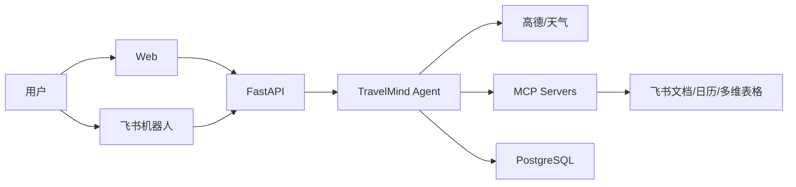
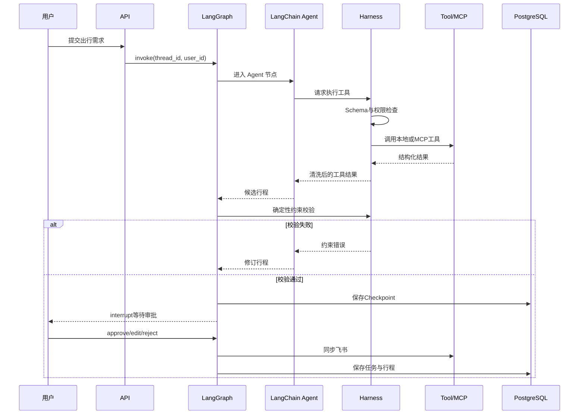

# 详细架构设计

## 1. 架构目标

架构需要同时满足三个目标：

1. 当前以单 Agent完成真实业务闭环。
2. Harness机制清晰，便于逐层学习和测试。
3. 将来增加子 Agent时复用工具、权限、任务、记忆和 MCP连接。

## 2. 系统上下文



## 3. 逻辑分层

```text
入口层       Web API、SSE、飞书 Webhook
应用层       会话、行程、审批、任务 API
Agent层      LangChain create_agent、Prompt、Skills
Harness层    Tools、Permissions、Hooks、Context、Memory、Recovery、MCP
Runtime层    LangGraph Checkpoint、Interrupt、Store、Streaming
领域层       行程模型、约束校验、重规划规则
基础设施层   PostgreSQL、HTTP API、MCP Server、Scheduler
```

依赖方向始终由上向下；领域校验不依赖LLM。

## 4. 核心运行流程



## 5. Agent Runtime

新项目使用 LangChain v1 的 `create_agent`：

- 负责模型调用和Tool Calling循环。
- 使用 `state_schema` 保存当前Agent状态。
- 使用 `context_schema` 注入用户、线程和权限上下文。
- 使用Middleware装配动态Prompt、上下文压缩、权限和工具错误处理。
- 使用 `ToolStrategy` 或 `ProviderStrategy` 输出结构化行程。

不再使用旧的 `langgraph.prebuilt.create_react_agent`，也不复制框架内部Agent Loop。

## 6. Trip Lifecycle Graph

外层 LangGraph只表达必须持久化的业务阶段：

```text
INTERACTING
→ VALIDATING
→ WAITING_APPROVAL
→ SYNCHRONIZING
→ MONITORING
→ REPLANNING
→ COMPLETED
```

状态迁移：

| 当前状态 | 事件 | 下一状态 |
|---|---|---|
| INTERACTING | Agent生成候选行程 | VALIDATING |
| VALIDATING | 失败 | INTERACTING |
| VALIDATING | 通过 | WAITING_APPROVAL |
| WAITING_APPROVAL | 修改 | INTERACTING |
| WAITING_APPROVAL | 拒绝 | INTERACTING或CANCELLED |
| WAITING_APPROVAL | 批准 | SYNCHRONIZING |
| SYNCHRONIZING | 完成 | MONITORING |
| MONITORING | 环境变化 | REPLANNING |
| REPLANNING | 新方案生成 | VALIDATING |
| MONITORING | 行程结束 | COMPLETED |

## 7. 状态设计

### Runtime Context

不会写入消息历史，用于本次调用：

```text
user_id
thread_id
channel
timezone
permission_scope
request_id
```

### Agent State

由 LangGraph持久化：

```text
messages
trip_id
trip_status
requirements
todo_items
candidate_itinerary
validation_errors
pending_approval
sync_status
```

### 长期存储

- Trip：业务行程。
- UserPreference：跨会话用户偏好。
- Task：持久任务及依赖。
- ToolAudit：工具审计。
- Outbox：待发送或待同步事件。

## 8. 数据一致性

- Checkpoint负责恢复Agent执行现场，不代替业务表。
- Trip表保存用户最终认可的业务结果。
- 外部写入先保存Outbox，再调用飞书；失败时保留重试记录。
- 同步操作使用 `trip_id + action + version` 作为幂等键。
- Checkpoint、业务表和外部系统之间采用最终一致性，不做分布式事务。

## 9. 部署架构

第一版是单体应用：

```text
travelmind-api
├── FastAPI
├── LangChain/LangGraph
├── MCP Manager
└── APScheduler

postgres
frontend
```

Docker Compose负责本地启动。第一版不加入Redis、消息队列和微服务。多实例部署前，再把Scheduler和后台执行从API进程中拆出。

## 10. 多 Agent 演进

单 Agent出现以下信号后再拆分：

- 工具数量让模型选择准确率明显下降。
- 上下文压缩仍无法控制Token成本。
- 路线、风险等任务需要真正并行且相互隔离。
- 专业任务需要独立模型、权限或评测集。

可能的未来拓扑：

```text
Supervisor
├── Planner Agent
├── Route Agent
├── Risk Agent
└── Collaboration Agent
```

新增的只是Agent注册、上下文隔离、任务分派和Agent间协议；Harness核心模块保持不变。

