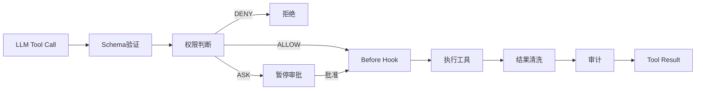

# Harness 与 MCP 设计

## 1. Harness范围

本项目采用：

```text
Agent = LLM + Harness
```

Harness包含模型在出行领域中行动所需的一切运行环境：

```text
Agent Runtime
Tool Registry
Permission Engine
Middleware / Hooks
Todo与Task System
Skill Loader
Context Compact
Memory
Error Recovery
Background Runner
Scheduler
Checkpoint
MCP Manager
```

## 2. Tool Registry

Tool Registry统一管理本地工具和MCP工具。每个工具至少具有：

```text
name
description
input_schema
source
risk_level
timeout_seconds
retry_policy
```

命名规则：

```text
{namespace}.{action}

amap.search_poi
weather.get_forecast
trip.validate_itinerary
feishu.create_document
```

禁止工具使用含糊名称，例如 `execute`、`do_action`。

## 3. 工具执行管线



执行结果不得把HTML、调试日志或完整外部响应直接塞入上下文，应转换成领域相关字段。

## 4. 权限模型

决策只有三种：

```text
ALLOW：自动执行
ASK：使用LangGraph interrupt等待用户
DENY：拒绝执行并告诉模型原因
```

权限输入：

- 用户身份与授权范围。
- Agent身份；当前固定为 `travel_agent`。
- Tool名称与风险等级。
- 参数中涉及的目标用户、群聊或文档。
- 当前会话是否已有有效批准。

安全原则：

- MCP Server声明工具不代表Harness允许执行。
- 密钥永远不暴露给LLM。
- 向第三方发送消息、创建日历和删除内容必须审批。
- 查询类工具也需要输入边界与调用频率限制。

## 5. Middleware与Hooks

优先使用 LangChain v1 Middleware：

- 动态System Prompt。
- `before_model`：注入记忆和Skill摘要。
- `after_model`：结构化输出检查。
- `wrap_tool_call`：权限、超时、错误分类和审计。
- Summarization：上下文接近阈值时压缩。

自定义Hook仅补充框架没有覆盖的领域事件，例如 `TripApproved`、`TripChanged`。

## 6. Context Compact

从轻到重采用四级策略：

1. 删除已失效或重复的工具结果。
2. 截断过长字段，保留来源ID和摘要。
3. 将多个地点、路线结果压成结构化候选表。
4. 将旧消息压缩成保留事实、决策和未完成任务的摘要。

绝不能压掉：

- 用户硬约束。
- 待审批操作。
- 当前行程版本。
- 未完成任务。
- Tool Call与Tool Result的对应关系。

## 7. Memory

记忆生命周期：

```text
选择：什么值得记
提取：转换成结构化事实
合并：更新或淘汰旧事实
```

示例：

```json
{
  "max_walking_distance_m": 3000,
  "preferred_transport": ["metro", "taxi"],
  "dietary_restrictions": ["no_spicy"],
  "travels_with_elderly": true
}
```

第一版使用PostgreSQL JSONB和明确字段，不使用向量检索。

## 8. Error Recovery

| 错误类型 | 策略 |
|---|---|
| 网络超时 | 最多重试2次，带短退避 |
| 参数错误 | 返回模型修正，不重复原请求 |
| 限流 | 读取Retry-After或延迟任务 |
| MCP会话过期 | 重建该Server连接并刷新工具 |
| 数据源不可用 | 使用备用源或说明缺失 |
| 输出解析失败 | 使用结构化输出重试一次 |
| 上下文超限 | 压缩后恢复 |
| 外部写入失败 | 写入Outbox，后台重试 |
| 用户拒绝审批 | 修改计划，不重试原操作 |

## 9. MCP Host设计

TravelMind是MCP Host，内置一个MCP Manager；每个Server对应独立Client Session：

```text
MCPManager
├── feishu -> MCPClientSession
├── amap -> MCPClientSession
└── future -> MCPClientSession
```

### 启动生命周期

```text
读取mcp.json
→ 建立stdio或Streamable HTTP连接
→ session.initialize()
→ 检查Server capabilities
→ session.list_tools()
→ 转换为LangChain Tool
→ 注册Tool Registry
```

### 调用生命周期

```text
Tool Registry定位Server和原始工具名
→ Permission Engine
→ session.call_tool(name, arguments)
→ MCP结果标准化
→ Tool Audit
```

### 连接生命周期

- FastAPI lifespan中启动和关闭连接。
- 单个Server失败只卸载该命名空间工具。
- Streamable HTTP会话过期时重建连接。
- 连接恢复后重新执行 `list_tools`。
- 测试使用官方SDK内存Client，不启动真实子进程。

## 10. MCP配置

```json
{
  "servers": {
    "feishu": {
      "transport": "streamable_http",
      "url_env": "FEISHU_MCP_URL",
      "token_env": "FEISHU_MCP_TOKEN",
      "enabled": true
    },
    "demo": {
      "transport": "stdio",
      "command": "python",
      "args": ["-m", "tests.fake_mcp_server"],
      "enabled": false
    }
  }
}
```

配置文件只保存环境变量名称，不保存Token值。

## 11. 飞书接入

飞书具有两个不同角色：

```text
飞书Webhook：用户消息进入系统
飞书MCP：Agent创建文档、日历、表格或发送消息
```

第一版飞书MCP能力：

- 创建或更新行程文档。
- 写入多维表格行程明细。
- 创建或更新用户确认后的日历事件。
- 向当前用户发送变更通知。

文档使用新版 `docx` API；日历和用户数据根据飞书要求使用相应用户授权。所有外部写入必须幂等。

## 12. 多 Agent兼容性

当前不实现子Agent，但调用上下文保留：

```text
agent_id
task_id
thread_id
permission_scope
```

未来所有Agent共享MCP Manager，不各自创建重复连接；Tool Registry根据 `agent_id` 过滤工具和权限。

