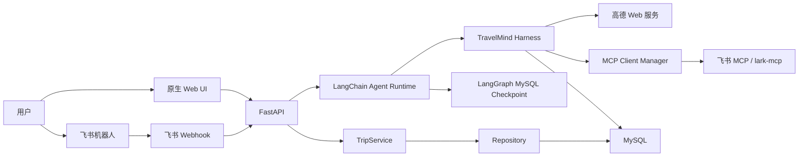
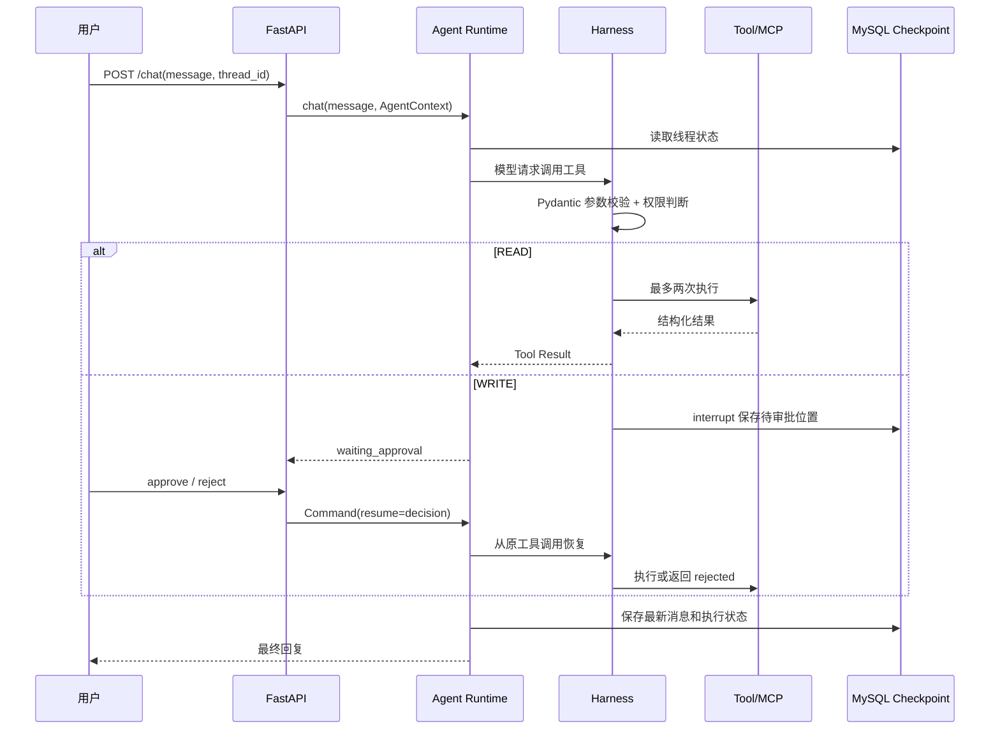

# 详细架构设计

## 1. 架构目标

TravelMind 当前采用单体、单 Agent、本地运行架构，目标是：

1. 完成真实出行业务闭环，而不是停留在模型对话。
2. 让 Harness 的工具、权限、审批、记忆、任务和 MCP 机制可以分别学习和测试。
3. 保持清晰的 Controller → Service → Repository 数据库分层。
4. 将来需要多 Agent 时复用现有 Harness，而不是重写工具和基础设施。

## 2. 系统上下文



## 3. 代码分层

```text
入口层          frontend、api/routes、channels
应用层          services、api/dependencies
Agent 层        agent/runtime、prompts、state
Harness 层      registry、permissions、middleware、memory、tasks、skills、scheduler
领域层          domain/models、domain/constraints
工具层          tools/*、mcp/tool_adapter
基础设施层      SQLAlchemy models/repositories、checkpoint、outbox、MCP transport
```

关键依赖规则：

- `api/routes` 只完成 HTTP 协议转换和调用，不直接查询 MySQL。
- `services` 决定业务流程和事务边界。
- `repositories` 只负责 SQLAlchemy 查询和写入，不提交事务、不调用 LLM。
- `domain` 不依赖 FastAPI、LangChain、MCP 或数据库。
- 本地工具和 MCP 工具都必须进入同一个 Harness 权限管线。
- Checkpoint 保存 Agent 执行现场，业务表保存用户行程，两者不能互相代替。

## 4. 应用组合与生命周期

`backend/app/main.py` 是组合根。FastAPI lifespan 按以下顺序启动：

```text
创建/补齐业务表
→ 创建 MemoryStore、TaskStore、SkillLoader、EventBroker
→ 注册本地 Tool Registry
→ 读取 config/mcp.json 并启动各 MCP Session
→ 动态注册 MCP 工具
→ 初始化 LangGraph MySQL Checkpoint
→ 启动 Outbox Worker 和 Scheduler
→ 首次请求时创建并缓存 Agent Runtime
```

退出时取消后台循环、关闭 MCP Session 和 Checkpoint 上下文。

## 5. Agent 执行流程



当前没有额外手写的“Trip Lifecycle Graph”。`agent/graph.py` 仅保留说明；真正的模型—工具循环由 LangChain `create_agent` 构建的 LangGraph 执行，审批由 Harness 中的 `interrupt()` 注入。

## 6. Agent Runtime

`agent/runtime.py` 完成以下装配：

- 默认模型：OpenAI 兼容协议的千问 `qwen3.5-plus`，`temperature=0`。
- LangChain v1 `create_agent`。
- `AgentContext(user_id, thread_id, channel, agent_id)`。
- 动态 Prompt：系统规则 + 当前用户偏好 + Skill 清单。
- `SummarizationMiddleware`：达到 40 条消息时摘要，保留最近 20 条。
- LangGraph Checkpointer：生产使用 MySQL，测试可使用内存实现。
- Harness 工具适配为 LangChain `StructuredTool`。

Runtime 对 API 暴露四项稳定能力：聊天、查询待审批项、恢复审批、读取可见聊天历史。

## 7. 数据与状态

### 运行上下文

`AgentContext` 不写入用户消息：

```text
user_id
thread_id
channel
agent_id = travel_agent
```

### Agent 执行状态

实际执行状态由 `create_agent` 的消息状态和 LangGraph Checkpoint 管理。`TravelAgentState` 是为未来外层业务图预留的类型，目前没有接入运行流。

### MySQL 业务数据

```text
users               本地账号
trips               行程主表
itinerary_items     日程项，使用逻辑外键 trip_id
user_preferences    结构化长期偏好
harness_tasks       单 Agent 依赖任务
webhook_events      飞书事件去重
outbox_events       可靠 MCP 写入
scheduled_jobs      24h/2h 天气复查
```

LangGraph Checkpoint 表由 Checkpointer 自己创建，不在 `schema.sql` 的业务表清单内。

## 8. 行程数据流

HTTP 行程接口严格遵循：

```text
trips.py Controller
→ TripService
→ TripRepository / ItineraryItemRepository
→ SQLAlchemy ORM
→ MySQL
```

`TripService` 拥有事务：

- 创建行程时同时安排天气任务。
- 完整行程与全部日程项一次提交。
- 失败时统一 rollback。
- 归档/删除时取消待执行天气任务。
- 删除行程时应用层删除逻辑关联的日程项。

## 9. 自动任务与外部一致性

Scheduler 每分钟扫描最多 10 个到期任务，每项最多尝试 3 次：

```text
scheduled_jobs 到期
→ 高德天气
→ 同一 TravelMind Agent 生成建议
→ 保存 weather + advice
→ 若 thread_id 是 feishu:{chat_id}，发送主动通知
```

飞书消息使用 Outbox：

```text
生成固定幂等键
→ 写入 outbox_events
→ MCP call_tool
→ 成功标记 completed
→ 失败指数退避，最多 5 次
```

这是一致性边界：MySQL 不与飞书做分布式事务，外部结果采用最终一致性。

## 10. 用户隔离

- 匿名用户使用 `anonymous`。
- 登录用户使用 `web:{user_id}`。
- 飞书用户使用 `feishu:{open_id}`。
- Web 会话通过 `web:{user_id}:{thread_id}` 命名。
- 飞书群聊会话通过 `feishu:{chat_id}` 命名。
- 行程 Repository 始终带 `owner_id` 查询条件。

`AUTH_REQUIRED=true` 时，无 Bearer Token 的 Web API 请求返回 401；默认学习模式允许匿名访问。

## 11. 本地部署形态

```text
一个 FastAPI 进程
├── Agent Runtime
├── MCP Manager
├── Scheduler
├── Outbox Worker
└── 原生静态前端

一个 MySQL 实例
外部：千问、高德、可选飞书 MCP
```

项目明确不提供 Docker Compose、CI/CD 和云部署。因为当前只用于本地演示，也没有引入 Redis、消息队列或独立 Worker。

## 12. 多 Agent 演进边界

当前不实现多 Agent。只有出现可测量问题时再拆分，例如工具选择准确率下降或确实需要并行专业任务。未来可增加 Supervisor/Planner/Route Agent，但继续共享：

- Tool Registry 与 Permission Engine。
- MCP Manager。
- Memory、Task 和 Skill。
- Checkpoint、Outbox 和业务数据库。

因此当前 Harness 是可扩展基础，而不是已经存在的多 Agent 框架。
