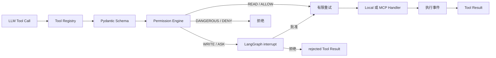

# Harness 与 MCP 设计

## 1. Harness 在项目中的含义

本项目使用下面的工程化表达：

```text
Agent = LLM + Harness
```

LLM 负责理解和选择行动；Harness 负责提供可用工具、运行上下文、安全边界、持久状态和失败恢复。TravelMind 当前 Harness 包含：

```text
Tool Registry          Permission Engine
Tool Executor          LangGraph Interrupt/Checkpoint
Memory                 Task Store
Skill Loader           Context Summarization
Retry Policy           Event Broker
Scheduler              Outbox
MCP Client Manager
```

MCP 是 Harness 的外部工具接入协议，不是 Agent 本身，也不会替代权限控制。

## 2. Tool Registry

每个 `ToolDefinition` 当前只有必要字段：

```text
name          namespace.action 唯一名称
description   给模型看的用途和调用边界
args_model    Pydantic 输入模型
handler       同步或异步处理函数
source        local 或 mcp:{server}
risk_level    READ / WRITE / DANGEROUS
```

Registry 保证名称唯一，调用前使用 Pydantic 校验输入，再执行 handler。

### 当前本地工具

| 工具 | 风险 | 用途 |
|---|---|---|
| `budget.calculate_trip_cost` | READ | Decimal 预算计算 |
| `itinerary.validate` | READ | 时间、预算、步行和必去地点校验 |
| `amap.geocode` | READ | 地点转坐标 |
| `amap.search_poi` | READ | 真实 POI 搜索 |
| `amap.weather` | READ | 当前/未来天气 |
| `amap.plan_route` | READ | 步行/驾车/公交路线 |
| `trip.get` | READ | 查询当前用户行程 |
| `trip.create` | WRITE | 创建行程草稿 |
| `trip.save_itinerary` | WRITE | 校验后原子保存完整行程 |
| `trip.add_itinerary_item` | WRITE | 新增日程项 |
| `memory.save_preferences` | WRITE | 合并明确用户偏好 |
| `task.create/list/complete` | 混合 | 创建、查询、完成依赖任务 |
| `skill.load` | READ | 按名称加载完整 Skill |

高德工具只有配置 `AMAP_API_KEY` 后才注册。MCP 工具根据运行时 `tools/list` 动态加入同一 Registry。

## 3. 工具执行管线



当前规则：

- READ 自动执行，网络类 `TimeoutError`/`ConnectionError` 最多执行 2 次。
- WRITE 触发审批，批准后执行 1 次，避免重复副作用。
- DANGEROUS 直接拒绝。
- 工具事件包括 `tool.started`、`approval.required`、`tool.rejected`、`tool.failed`、`tool.completed`。

审批位置保存在 LangGraph Checkpoint 中，`POST /approvals/{thread_id}` 使用 `Command(resume=...)` 从原工具调用位置继续。

## 4. Prompt 与上下文

稳定系统规则在 `agent/prompts.py`，包括：实时信息必须使用高德、完整行程先校验、写操作先审批、只有用户明确要求才保存。

动态 Prompt 每轮加入：

- 当前用户的结构化偏好。
- 当前可用 Skill 的名称和简介。

长上下文由 LangChain `SummarizationMiddleware` 处理：默认 40 条消息触发，保留最近 20 条。`harness/context.py` 另提供确定性尾部裁剪函数，当前主要用于独立测试和未来非模型压缩场景。

## 5. Memory

Memory 使用 MySQL `user_preferences`，按 `user_id` 隔离：

```json
{
  "max_walking_distance_m": 3000,
  "preferred_transport": ["地铁"],
  "dietary_restrictions": ["素食"],
  "travels_with_elderly": true
}
```

列表字段去重合并，明确提供的标量覆盖旧值。Memory 只保存用户明确表达的长期偏好，不保存整段聊天，不使用向量数据库。

## 6. Task

Task 使用 MySQL `harness_tasks`，字段包括 `task_id`、用户、线程、描述、依赖、状态、结果和 `agent_id`。

```text
task.create → 创建 pending 任务
task.list   → 查看全部或当前可执行任务
task.complete → 标记 completed 并写入结果
```

可执行条件是：任务为 pending，且 `blocked_by` 中的任务全部完成。当前所有任务都由 `travel_agent` 执行，没有子 Agent 调度。

## 7. Skill

`SkillLoader` 启动时只扫描 `skills/*/SKILL.md` 的 `name` 和 `description`，完整内容只有 Agent 调用 `skill.load` 时才读取。

当前 Skill：

- `budget-travel`：预算旅行取舍。
- `family-travel`：老人/儿童低强度行程。

Skill 只是按需知识，不持有密钥、不能执行代码，也不能绕过 Tool Registry。

## 8. MCP Host

TravelMind 是 MCP Host。`MCPManager` 为每个启用的 Server 维护独立 Client Session：

```text
读取 config/mcp.json
→ 为 stdio 或 Streamable HTTP 创建传输
→ ClientSession.initialize()
→ list_tools()
→ JSON Schema 转 Pydantic Model
→ 注册为 {server}.{remote_tool}
→ Agent 通过 Harness 调用
```

一个 Server 连接失败时，错误写入 `manager.errors`，其他 Server 和本地工具继续启动。应用结束时按反序关闭全部 Session。

当前没有运行时热重连；服务重启时会按配置重新连接和发现工具。

## 9. MCP 配置与凭证

`config/mcp.json` 是本地运行配置且被 Git 忽略；仓库只提交 `mcp.example.json`。配置里保存环境变量名称，不保存真实 Token。

支持两种传输：

```json
{
  "transport": "stdio",
  "command": "python",
  "args": ["-m", "tests.fake_mcp_server"]
}
```

```json
{
  "transport": "streamable_http",
  "url_env": "FEISHU_MCP_URL",
  "token_env": "FEISHU_MCP_TOKEN"
}
```

stdio 可通过 `env_from` 把明确白名单环境变量映射给子进程；Windows 上 `npx` 自动转换为 `npx.cmd`。

## 10. 飞书 MCP

项目支持两个官方入口：

### 飞书远程 MCP

- 默认地址：`https://mcp.feishu.cn/mcp`。
- 使用 App ID/Secret 自动获取并缓存 tenant token。
- 通过 `X-Lark-MCP-TAT` 和 `X-Lark-MCP-Allowed-Tools` 请求头认证。
- 示例白名单开放 `fetch-doc`。

### 官方 `@larksuiteoapi/lark-mcp@0.5.1`

- 作为 stdio 子进程启动。
- 当前白名单包含消息、docx 文档和日历相关 7 个工具。
- 工具名中的 create/update/delete/send/write 会自动映射为 WRITE。
- WRITE 仍需经过 Harness 审批。

普通飞书聊天回复不让模型主动调用发消息工具，而由 Channel 在 Agent 完成后统一回复，避免重复消息。

## 11. Outbox 与幂等

飞书回复和天气主动通知使用：

```text
topic = mcp.call_tool
payload = {tool, arguments}
idempotency_key = 业务稳定键
```

Outbox 每 5 秒扫描可执行事件，失败后按 `2^attempts` 秒退避，最多 5 次。成功标记 `completed`。这保证本地业务结果不会因一次飞书网络失败而丢失。

目前 Outbox 主要覆盖渠道消息和天气通知；Agent 自己发起的所有 MCP 写操作尚未统一自动进入 Outbox。

## 12. 当前边界

- 没有持久化 ToolAudit 表；执行轨迹当前保存在 EventBroker 内存和应用日志。
- 没有工具级独立超时配置，外部 HTTP 工具使用各自客户端超时。
- MCP JSON Schema 适配覆盖常见基本类型，不是完整 JSON Schema 实现。
- 不实现多 Agent，但未来 Agent 应共享 Registry、Permission、Memory、Task 和 MCP Manager。
