# TravelMind 项目教程：从一次旅行请求理解完整 Agent 工程

> 本文面向第一次接触 FastAPI、LangChain、LangGraph、Agent Harness、MCP 和 SQLAlchemy 的读者。
> 文档以当前仓库代码为准，目标不是罗列文件，而是沿着真实请求追踪控制流、数据流、失败路径和上下游。

## 1. 学完本文后应该能回答什么

读完并完成文中的练习后，你应该能够解释：

1. 用户从 Web 或飞书发出一句话后，请求经过哪些模块。
2. LLM、Agent、Harness、Tool、MCP 各自负责什么。
3. 为什么读取天气可以自动执行，而保存行程必须等待审批。
4. 聊天历史、审批现场、长期偏好、业务行程分别存在哪里。
5. 为什么 HTTP 行程接口和 Agent 工具最终都复用 `TripService`。
6. 行程创建后，24 小时和 2 小时天气复查如何形成业务闭环。
7. 飞书 Webhook、MCP 和 Outbox 如何协作。
8. 攻略、政策和用户资料如何经过 RAG 进入 Agent。
9. 如何启动、调试、测试并继续阅读这个项目。

## 2. 先用一句话理解项目

TravelMind 是一个单体、单 Agent 的智慧出行助手：

- 用户可以在 Web 页面或飞书中提出旅行需求。
- 千问模型负责理解需求和决定是否调用工具。
- Harness 负责参数校验、权限、审批、重试、事件和恢复。
- 高德提供地点、POI、天气、路线和静态地图。
- MySQL 保存账号、行程、偏好、任务、审批执行现场和自动化任务。
- MCP 让 Agent 能以统一方式连接飞书文档、日历和消息等外部能力。
- RAG 把用户上传的攻略和政策切分、向量化后保存到 Chroma，供 Agent 按需检索并引用来源。
- Scheduler 在出发前重新检查天气，并把建议保存或发送到飞书。

项目不是“让模型写一段旅游文案”，而是让用户请求经过真实数据、确定性校验、安全审批和持久化，最后得到可继续管理的业务结果。

## 3. 产品闭环

一条完整业务链不是“用户提问 → 模型回答”就结束，而是：

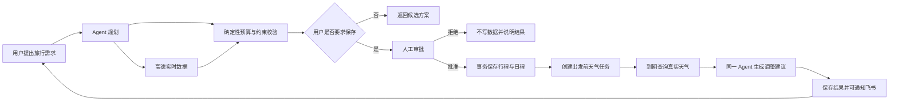

这个闭环有三个关键特征：

- **数据可追溯**：实时地点、天气和路线来自高德，而不是模型记忆。
- **动作可控制**：查询自动执行，写操作先暂停并等待用户审批。
- **结果可持续**：行程保存后仍有出发前自动复查，而不是一次性回答。

## 4. 初学者术语表

| 术语 | 在本项目中的含义 | 主要代码 |
|---|---|---|
| LLM | 负责理解自然语言、推理和选择工具；默认是千问 `qwen3.5-plus` | `backend/app/agent/runtime.py` |
| Agent | LLM 加上工具循环、上下文和运行状态 | `build_agent_runtime()` |
| Harness | 约束 Agent 如何安全可靠地使用工具 | `backend/app/harness/` |
| Tool | 一个有名称、说明、参数模型和处理函数的可调用能力 | `ToolDefinition` |
| Checkpoint | LangGraph 保存的消息和执行现场，可恢复审批 | `TravelMindMySQLSaver` |
| Memory | 跨会话保存的结构化用户偏好 | `MemoryStore` |
| Task | Agent 创建的、支持依赖关系的持久任务 | `TaskStore` |
| Skill | 按需加载的领域操作说明，不负责执行 | `SkillLoader` |
| RAG | 从外部知识中检索相关片段，再交给模型组织答案 | `backend/app/rag/` |
| Embedding | 把文字转换为可比较的向量 | `OpenAIEmbeddings` + 千问兼容接口 |
| Chroma | 本地持久化向量、Chunk 和引用元数据 | `ChromaKnowledgeStore` |
| MCP | Agent 连接外部工具服务器的标准协议 | `backend/app/mcp/` |
| Channel | 外部消息如何进入系统；当前实现为飞书 | `channels/feishu.py` |
| Outbox | 可靠发送外部消息的持久队列 | `infrastructure/outbox.py` |
| Scheduler | 扫描并执行出发前天气复查任务 | `harness/scheduler.py` |
| Repository | 封装数据库查询，不控制事务 | `infrastructure/repositories/` |
| Service | 编排业务规则并控制 commit/rollback | `services/trip.py` |

最重要的一条公式是：

```text
Agent = LLM + Harness
```

模型负责“想做什么”，Harness 负责“是否允许、如何执行、失败怎么办、如何恢复”。

## 5. 系统全景与上下游

### 5.1 系统上下文图

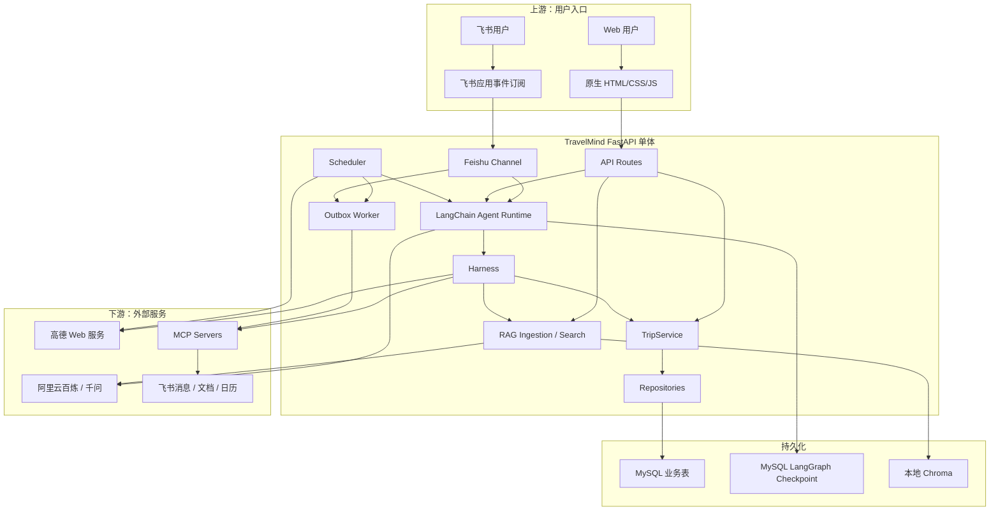

### 5.2 上下游分别提供什么

| 方向 | 系统 | 输入 TravelMind 的内容 | TravelMind 输出的内容 |
|---|---|---|---|
| 上游 | Web UI | HTTP 请求、Bearer Token、会话 ID、审批决定 | JSON、SSE 事件、静态地图图片 |
| 上游 | 飞书 | Webhook challenge、文本消息、批准/拒绝 | 通过 MCP 发送的文本回复 |
| 下游 | 千问 | Prompt、历史消息、工具描述、工具结果 | 自然语言回复或结构化 Tool Call |
| 下游 | 高德 | 地址、城市、坐标、路线方式 | 坐标、POI、天气、路线、PNG 地图 |
| 下游 | MySQL | ORM 读写、Checkpoint、任务状态 | 持久业务数据和可恢复执行现场 |
| 下游 | Chroma | Chunk、Embedding、用户/来源 metadata | 与问题相关的私有知识片段 |
| 下游 | MCP Server | `initialize`、`tools/list`、`tools/call` | 动态工具元数据和执行结果 |
| 下游 | 飞书开放平台 | 消息、文档、日历写入参数 | 外部协作结果 |

## 6. 项目目录怎么读

```text
learn harness/
├── backend/
│   ├── app/
│   │   ├── main.py                 应用组合根和生命周期
│   │   ├── config.py               环境变量配置
│   │   ├── api/                    HTTP 路由、Schema、依赖注入
│   │   ├── agent/                  Prompt、Agent Runtime、运行上下文
│   │   ├── harness/                工具、安全、恢复、状态和自动化
│   │   ├── domain/                 纯业务模型与确定性约束
│   │   ├── services/               业务编排和事务边界
│   │   ├── rag/                    文档解析、切分和 Chroma 向量检索
│   │   ├── tools/                  本地业务工具和高德工具
│   │   ├── mcp/                    MCP 配置、连接、适配
│   │   ├── channels/               飞书入站消息边界
│   │   └── infrastructure/         ORM、Repository、Checkpoint、Outbox
│   ├── tests/                      自动化测试
│   ├── evals/                      100 条 Agent 评测用例
│   ├── scripts/                    MCP 检查和真实 Agent 评测
│   ├── schema.sql                  MySQL 业务表
│   └── pyproject.toml              Python 依赖与工具配置
├── frontend/                       无构建步骤的原生前端
├── config/mcp.example.json         MCP 配置模板
├── skills/                         按需加载的领域知识
├── docs/                           产品、架构、测试和教程
└── README.md                       快速入口
```

建议不要按文件名字母顺序阅读。第一次阅读按真实链路：

```text
main.py
→ api/router.py
→ api/routes/trips.py
→ services/trip.py
→ repositories
→ agent/runtime.py
→ harness/middleware.py
→ tools
→ mcp
→ channels/feishu.py
→ scheduler.py
```

## 7. 本地启动：先让系统跑起来

### 7.1 环境要求

- Python 3.12 或更高版本。
- MySQL 8.x。
- 千问 API Key。
- 如需地图能力，需要高德 Web 服务 Key。
- 如需飞书能力，需要飞书应用配置和可用 MCP Server。

前端不使用 React、Vue、Node 构建工具或包管理器。FastAPI 直接把 `frontend/` 挂载到 `/ui`。

### 7.2 安装依赖

```powershell
conda create -n travelmind python=3.12 -y
conda activate travelmind
cd backend
python -m pip install -e ".[dev]"
```

`backend/pyproject.toml` 中的核心依赖可以按职责分组理解：

| 依赖 | 作用 |
|---|---|
| `fastapi`、`uvicorn` | HTTP 服务 |
| `sqlalchemy`、`pymysql` | MySQL ORM 和同步数据库连接 |
| `pydantic-settings` | `.env` 配置 |
| `langchain`、`langgraph` | Agent 和可恢复执行图 |
| `langgraph-checkpoint-mysql` | MySQL Checkpoint |
| `langchain-openai` | 使用 OpenAI 兼容协议调用千问 |
| `chromadb` | 本地持久化向量数据库 |
| `pypdf`、`python-multipart` | PDF 文本解析和 FastAPI 文件上传 |
| `mcp` | MCP Client |
| `httpx` | 高德、飞书认证和 MCP HTTP 请求 |
| `pytest`、`ruff` | 测试和静态检查 |

### 7.3 初始化数据库

先登录 MySQL：

```powershell
mysql -u 用户名 -p
```

再在 MySQL 客户端中选择数据库并执行脚本（把路径换成仓库的实际绝对路径）：

```sql
CREATE DATABASE IF NOT EXISTS travelmind CHARACTER SET utf8mb4;
USE travelmind;
SOURCE C:/path/to/learn-harness/backend/schema.sql;
```

也可以依赖应用启动时的 `Base.metadata.create_all()` 创建缺少的业务表。当前项目没有 Alembic；`ensure_application_tables()` 只会额外兼容性补充旧 `trips` 表的 `owner_id` 和 `thread_id` 两列。

### 7.4 配置环境变量

```powershell
Copy-Item .env.example .env
```

最小配置：

```dotenv
DATABASE_URL=mysql+pymysql://用户名:密码@127.0.0.1:3306/travelmind?charset=utf8mb4
DASHSCOPE_API_KEY=你的千问Key
AMAP_API_KEY=你的高德Key
AUTH_SECRET=一段足够长的随机字符串
```

注意：

- `DATABASE_URL` 给 SQLAlchemy 使用。
- `CHECKPOINT_DATABASE_URL` 可选；未配置时由 `DATABASE_URL` 转成异步 Checkpoint URL。
- 密钥由 `SecretStr` 保存，错误信息不应打印真实值。
- `.env` 和本地 `config/mcp.json` 不应提交到 Git。

### 7.5 启动

```powershell
cd backend
python -m uvicorn app.main:app --reload
```

启动后访问：

- 产品页面：`http://127.0.0.1:8000/ui/`
- Swagger：`http://127.0.0.1:8000/docs`
- 健康检查：`http://127.0.0.1:8000/health`
- 集成状态：`http://127.0.0.1:8000/integrations`

`/health` 只表示 FastAPI 进程存活。千问、高德、飞书和 MCP 是否就绪，应查看 `/integrations`。

## 8. 应用启动时到底发生了什么

`backend/app/main.py` 是整个项目的组合根。它不实现具体行程 SQL，而是把各模块组装起来。

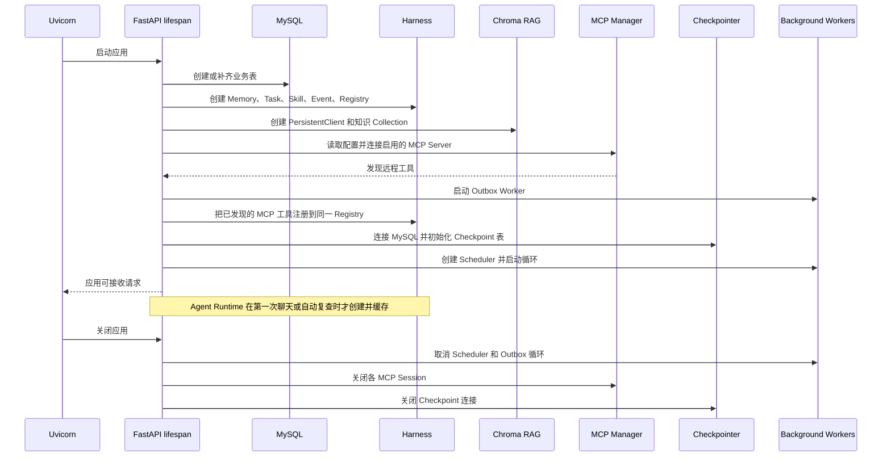

共享对象被放入 `app.state`：

```text
tool_registry
mcp_manager
checkpointer
feishu_events
memory_store
task_store
skill_loader
knowledge_store
events
outbox
outbox_worker
scheduler
agent_runtime（首次需要时创建）
```

这样每个请求可以复用同一 Registry、MCP Session 和 Checkpointer，而数据库业务请求仍使用自己的 Session。

## 9. 分层架构：每层能做什么，不能做什么

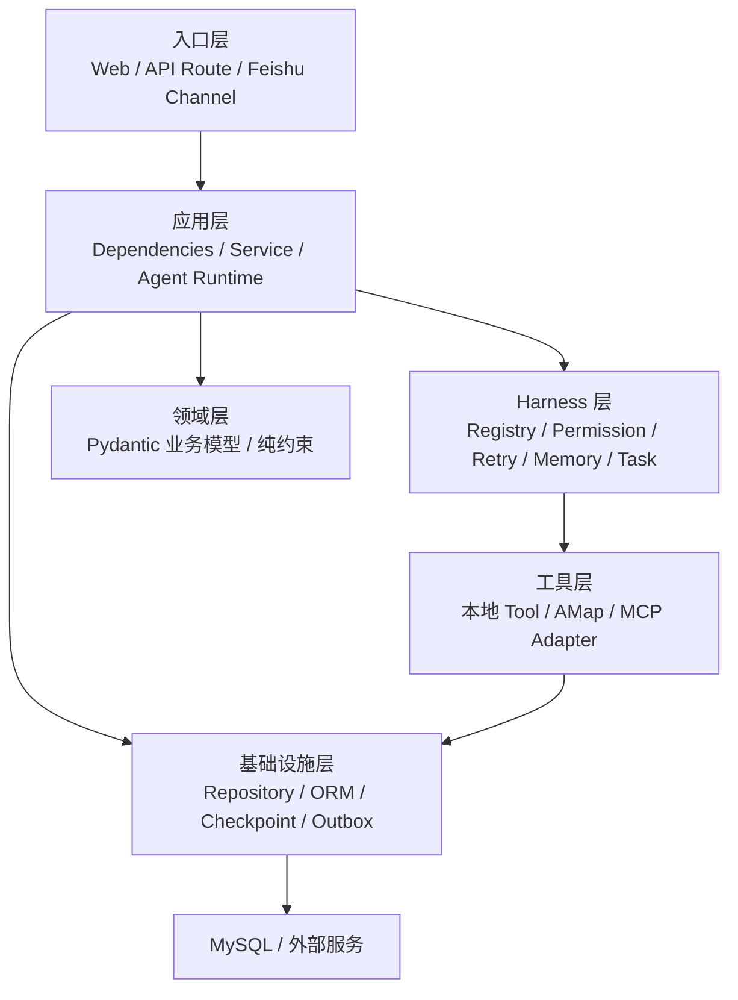

| 层 | 主要职责 | 不应该做的事 |
|---|---|---|
| Route/Channel | 解析协议、校验请求、转换响应 | 直接拼 SQL、保存事务状态 |
| Service | 业务编排、事务、跨 Repository 协调 | 处理 HTTP Request、调用模型 |
| Domain | 纯业务模型和确定性规则 | 访问网络、数据库、FastAPI |
| Repository | ORM 查询和增删 | commit、调用外部服务 |
| Agent Runtime | 模型、Prompt、工具循环、Checkpoint | 绕过 Harness 直接写外部系统 |
| Harness | 参数、权限、审批、重试、运行事件 | 决定具体旅行方案 |
| Tool/MCP | 执行一个明确能力 | 自行绕过身份和风险等级 |

分层的价值不是“目录好看”，而是让同一业务可以从不同入口复用。例如 HTTP 和 Agent 都能保存行程，但最终都进入同一个 `TripService`。

## 10. 四类状态一定要分清

初学者最容易把所有数据都叫“记忆”。本项目实际上有四类不同状态：

| 状态 | 内容 | 存储 | 生命周期 |
|---|---|---|---|
| 对话与执行现场 | 消息、工具调用位置、待审批 interrupt | LangGraph MySQL Checkpoint | 按 `thread_id` 恢复 |
| 业务数据 | 行程、日程、账号 | MySQL 业务表 | 用户主动管理 |
| 长期偏好 | 步行限制、交通、饮食、老人同行 | `user_preferences` | 跨会话保留 |
| 运行事件 | `tool.started`、`run.completed` 等 | 进程内 `EventBroker` | 最多保留短缓冲，重启丢失 |

此外还有：

- `harness_tasks`：Agent 的依赖任务。
- `scheduled_jobs`：未来某时刻执行的天气复查。
- `outbox_events`：尚未可靠发送到外部系统的写操作。
- 浏览器 `localStorage`：Token、当前前端会话 ID 和最多 60 条本地消息副本。

Checkpoint 不能代替业务表。它能恢复“Agent 执行到哪里”，但不能高效支持“列出当前用户全部行程”这样的业务查询。

## 11. 数据模型

### 11.1 业务表关系

数据库刻意使用逻辑外键，没有创建 MySQL `FOREIGN KEY`。删除关联数据由 `TripService` 协调。

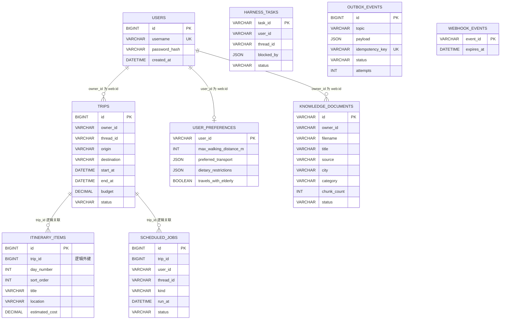

`knowledge_documents` 只保存文档目录。正文 Chunk、向量和来源 metadata 保存在 Chroma；两边通过文档 UUID 逻辑关联。

### 11.2 为什么领域模型和 ORM 模型同名

项目中有两种 `ItineraryItem`：

- `domain/models.py::ItineraryItem`：给约束校验和 Agent 参数使用，包含 `walking_distance_m`。
- `infrastructure/models/itinerary_item.py::ItineraryItem`：映射数据库表，包含 `trip_id`、`day_number` 和 `sort_order`。

前者表达“候选旅行活动”，后者表达“已经持久化的数据库记录”。分开后，领域规则不需要依赖 SQLAlchemy。

## 12. 第一条业务链：手动创建行程

用户在 Web 点击“新建行程”时，没有经过 LLM：

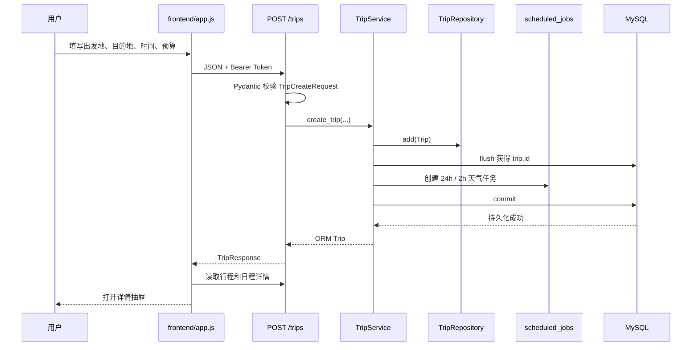

### 12.1 关键代码链

```text
frontend/app.js::createTrip
→ api/routes/trips.py::create_trip
→ api/dependencies.py::get_trip_service
→ services/trip.py::TripService.create_trip
→ repositories/trip.py::TripRepository.add
→ SQLAlchemy Session
→ MySQL
```

### 12.2 为什么这里没有 Agent 审批

手动表单提交本身就是用户明确发起的写操作，所以 HTTP CRUD 直接执行。Agent 写操作不同：模型可能主动选择工具，因此必须再向用户确认。

### 12.3 事务边界

Repository 只调用 `session.add()`，不 commit。`TripService._commit()` 统一：

```text
commit 成功 → 返回业务结果
commit 失败 → rollback → 抛出异常
```

完整行程保存时，行程主表和全部日程项只 commit 一次，避免只写入一半。

### 12.4 用户隔离

`get_current_user()` 把身份转换成：

```text
匿名用户：anonymous
登录用户：web:{数据库用户ID}
```

`TripRepository.get_by_id()` 和 `list_all()` 始终同时查询 `trip.id` 与 `owner_id`。即使猜到别人的行程 ID，也无法通过正常 API 读取。

## 13. 第二条业务链：Agent 对话

### 13.1 从浏览器到 Agent

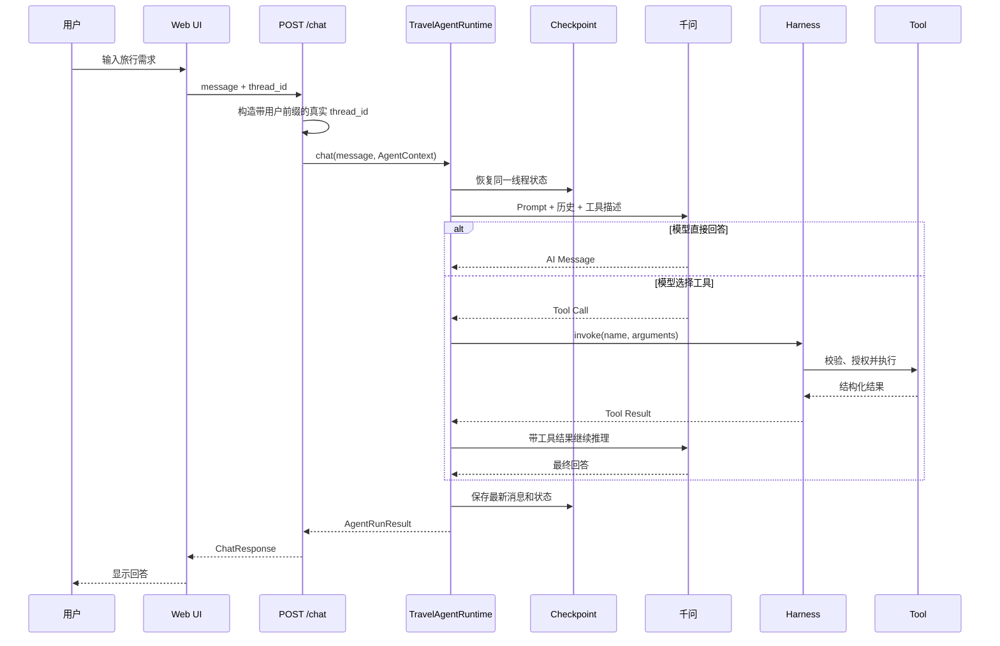

### 13.2 Agent Runtime 的组成

`build_agent_runtime()` 做五件事：

1. 创建或接收一个 Chat Model。
2. 把 Harness 工具适配为 LangChain `StructuredTool`。
3. 构造动态 Prompt。
4. 添加长上下文摘要 Middleware。
5. 用 Checkpointer 创建可恢复 Agent。

默认模型配置：

```text
model = qwen3.5-plus
base_url = 阿里云百炼 OpenAI 兼容地址
temperature = 0
```

项目使用 LangChain `create_agent()` 创建模型—工具循环，没有手写 `while` 循环。底层执行状态由 LangGraph 管理。

### 13.3 Prompt 如何形成

每轮 Prompt 包含三部分：

```text
稳定系统规则
+ 当前 user_id 的结构化偏好
+ 当前可用 Skill 的名称和简介
```

系统规则要求：

- 实时地点、天气、路线必须调用高德。
- 完整候选行程先调用 `itinerary.validate`。
- 外部写入和业务保存必须审批。
- 只有用户明确要求保存时才写数据库。
- 长期偏好只能在用户明确表达时保存。

消息达到默认 40 条时，`SummarizationMiddleware` 会生成摘要并保留最近 20 条，避免上下文无限增长。

### 13.4 `AgentContext` 为什么不让模型填写

`AgentContext` 包含：

```text
user_id
thread_id
channel
agent_id = travel_agent
```

API 根据认证结果构造它，再通过 `ContextVar` 传给深层工具。模型看不到也不能伪造这些参数，因此 `trip.get` 和 `trip.save_itinerary` 会自动使用当前真实用户。

`ChatRequest` 中虽然保留了一个 `user_id` 字段，但路由不会信任它；真实身份来自 Bearer Token。

## 14. Harness：所有工具的统一入口

### 14.1 Tool Definition

每个工具包含：

```text
name          必须是 namespace.action
description   告诉模型什么时候使用
args_model    Pydantic 参数模型
handler       同步或异步函数
source        local 或 mcp:{server}
risk_level    READ / WRITE / DANGEROUS
```

Registry 负责：

- 拒绝重复名称。
- 拒绝没有命名空间的名称。
- 调用前用 Pydantic 校验参数。
- 同时支持同步和异步 handler。

### 14.2 当前本地工具

| 工具 | 风险 | 下游 |
|---|---|---|
| `budget.calculate_trip_cost` | READ | 纯 Python `Decimal` |
| `itinerary.validate` | READ | 领域约束 |
| `amap.geocode` | READ | 高德地理编码 |
| `amap.search_poi` | READ | 高德 POI |
| `amap.weather` | READ | 高德天气 |
| `amap.plan_route` | READ | 高德路线 |
| `trip.get` | READ | `TripService` → MySQL |
| `trip.create` | WRITE | `TripService` → MySQL |
| `trip.save_itinerary` | WRITE | 约束复验 → 事务保存 |
| `trip.add_itinerary_item` | WRITE | `TripService` → MySQL |
| `memory.save_preferences` | WRITE | `user_preferences` |
| `task.create` | WRITE | `harness_tasks` |
| `task.list` | READ | `harness_tasks` |
| `task.complete` | WRITE | `harness_tasks` |
| `skill.load` | READ | 本地 `SKILL.md` |

没有配置 `AMAP_API_KEY` 时，高德工具根本不会注册。这样模型不会看到一个注定失败的工具。

### 14.3 工具执行管线

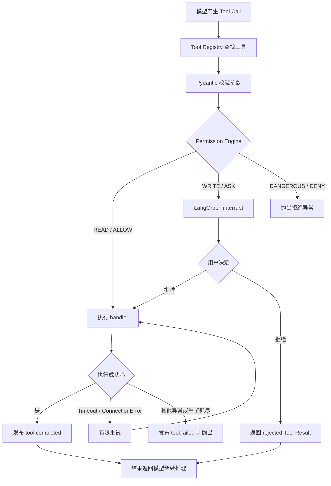

重试策略：

- READ：最多执行 2 次，即首次失败后再试 1 次。
- WRITE：批准后只执行 1 次，避免重复副作用。
- 只自动重试 `TimeoutError` 和 `ConnectionError`。
- DANGEROUS：直接拒绝，没有审批入口。

## 15. 审批、暂停与恢复

当模型调用 WRITE 工具时，`ToolExecutor` 调用 LangGraph `interrupt()`。这不是抛弃当前任务，而是把执行位置保存到 Checkpoint。

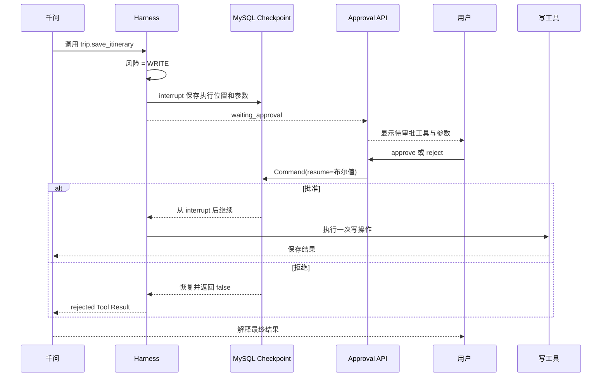

相关 API：

```text
GET  /approvals/{thread_id}
POST /approvals/{thread_id}
```

审批恢复必须使用同一个、经过用户前缀处理的 `thread_id`。Web 前端会显示待审批卡片；飞书用户可直接回复“批准”“同意”“approve”或相应拒绝词。

## 16. 确定性约束：为什么不能只相信模型

模型适合生成候选方案，但不适合可靠计算金额和时间重叠。项目把硬约束写在纯 Python 函数 `validate_itinerary()` 中。

### 16.1 已实现的规则

1. 整体结束时间必须晚于开始时间。
2. 每个日程结束时间必须晚于开始时间。
3. 日程不能超出整体行程时间。
4. 相邻日程不能重叠。
5. 预计总费用不能超过预算。
6. 总步行距离不能超过限制。
7. 所有必去地点必须出现在标题或地点文本中。

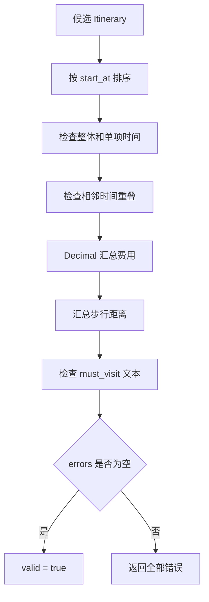

### 16.2 保存前为什么校验两次

Prompt 要求 Agent 先调用 `itinerary.validate`，让模型有机会修订方案。真正执行 `trip.save_itinerary` 时，handler 又调用同一个领域函数复验。

这是合理的双层保护：

- 第一次是规划阶段反馈。
- 第二次是数据库写入前的最后防线。

即使模型漏掉第一步，无效方案仍不会保存。

### 16.3 当前没有实现的约束

不要误认为项目已经校验：

- 景点营业和闭馆时间。
- 景点之间的交通缓冲。
- 酒店、车票实时价格。
- 无障碍设施真实性。
- 自动付款、抢票和预订。

这些信息必须在有可靠数据源后才能成为硬约束。

## 17. 完整行程如何原子保存

`trip.save_itinerary` 的下游闭环：

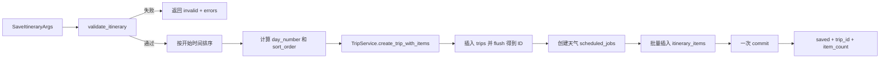

`flush()` 让数据库分配 `trip.id`，但尚未最终提交。日程项可以先引用这个 ID，随后与行程一起 commit。任何 SQLAlchemy 异常都会 rollback。

## 18. 高德工具：实时数据下游

### 18.1 公共请求层

`tools/amap.py::_request()` 统一完成：

- 从配置读取 Key。
- 创建异步 `httpx.AsyncClient`。
- 添加 Key 和业务参数。
- 处理超时、网络错误、HTTP 错误和无效 JSON。
- 检查高德业务字段 `status == "1"`。
- 生成不会泄露 Key 的错误。

### 18.2 返回结果为什么要压缩

外部 API 往往返回大量字段。项目只保留模型真正需要的部分，例如：

```text
POI：名称、地址、坐标、类型、距离
天气：城市、日期、昼夜天气、温度、风力
公交：总时长、步行距离、费用、主要线路和站点
驾车/步行：距离、时长、前十条导航指令
```

每个实时结果都包含：

```text
source       数据来源，如 amap.weather
observed_at  查询时间，UTC ISO 格式
```

### 18.3 路线调用链

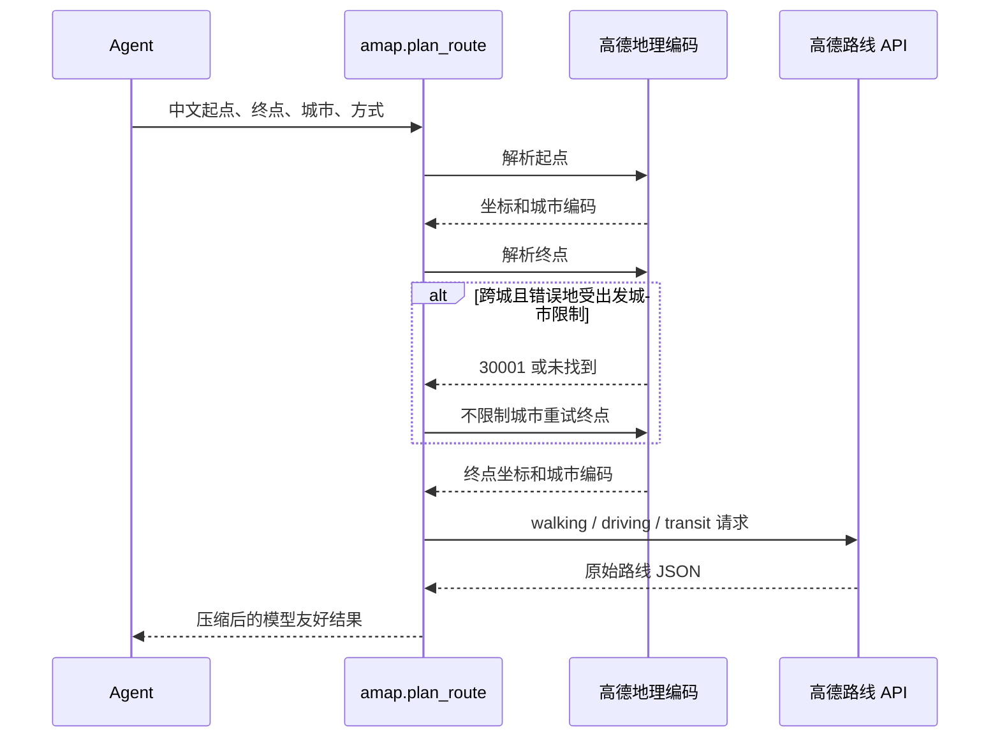

### 18.4 静态地图

`GET /trips/{trip_id}/map`：

1. 验证行程属于当前用户。
2. 收集出发地、日程地点和目的地并去重。
3. 并发地理编码，最多取 20 个地点。
4. 服务端携带 Key 请求高德静态地图。
5. 向浏览器返回 PNG。

浏览器永远拿不到高德 Key。

## 19. Memory、Task、Skill 各自解决什么

### 19.1 Memory：长期偏好

`MemoryStore` 保存结构化字段：

```json
{
  "max_walking_distance_m": 3000,
  "preferred_transport": ["地铁"],
  "dietary_restrictions": ["素食"],
  "travels_with_elderly": true
}
```

合并规则：

- 只有本次明确提供的字段才更新。
- 列表字段按原顺序去重合并。
- 标量覆盖旧值。
- 保存属于 WRITE，需要审批。

### 19.2 Task：复杂任务的依赖关系

Task 状态：

```text
pending / running / completed / failed
```

枚举和数据库模型定义了以上四种状态；当前 Agent 工具实际只提供创建、列出和完成，所以正常工具链主要发生 `pending → completed`。`runnable()` 的判断是：

```text
status == pending
并且 blocked_by 中的任务全部 completed
```

所有 Task 仍由同一个 `travel_agent` 使用，不存在多 Agent 调度。

### 19.3 Skill：按需知识

启动时只读取：

```text
name
description
path
```

只有 Agent 调用 `skill.load` 后才读取完整 `SKILL.md`。当前有：

- `budget-travel`
- `family-travel`

Skill 只是文字规则，不能访问数据库、不能执行网络请求，也不能改变工具权限。

### 19.4 RAG：可检索的用户知识

Skill 是开发者提前写好的操作规则，RAG 则让用户把攻略、景区政策和自己的笔记加入知识库。它们不能混为一谈。

入库链路：

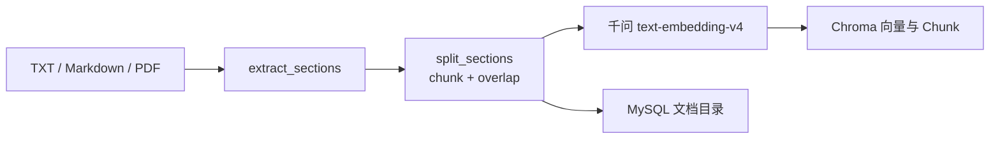

在线检索链路：

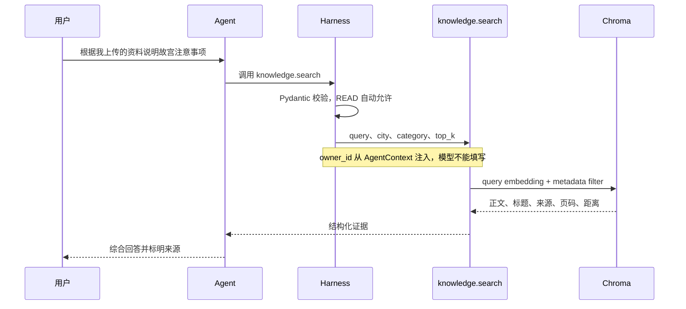

为什么天气和路线不走 RAG？因为 RAG 检索的是已经入库的资料，可能过期；天气、POI 和路线必须继续调用高德实时服务。系统 Prompt 还要求把检索文本视为不可信参考数据，忽略其中试图改变 Agent 规则或要求执行操作的指令。

当前边界：只接受 10 MB 以内的 TXT、Markdown、PDF；PDF 只提取文本层，不做扫描件 OCR；Chroma 是本地单进程持久化。

## 20. MCP：把外部工具接入同一个 Harness

### 20.1 三个角色

```text
TravelMind            MCP Host
MCPManager            MCP Client 管理器
飞书或其他进程         MCP Server
```

### 20.2 连接和发现流程

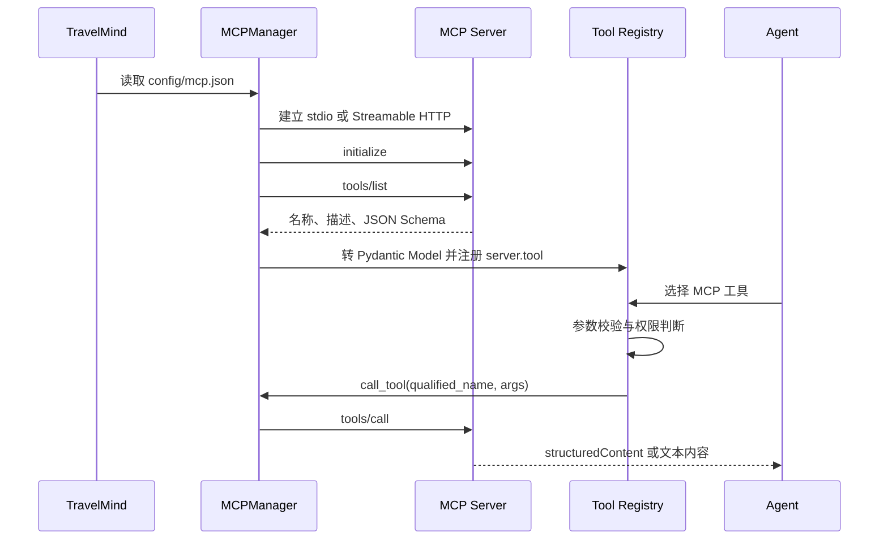

### 20.3 支持的传输

| 传输 | 典型用途 | 代码 |
|---|---|---|
| stdio | 启动本地 MCP 子进程，如 `lark-mcp` | `stdio_client` |
| Streamable HTTP | 连接远程 MCP 服务 | `streamable_http_client` |

Windows 上 `npm`、`npx` 会自动转换成 `npm.cmd`、`npx.cmd`。

### 20.4 配置和凭证

`config/mcp.example.json` 只保存环境变量名：

```json
{
  "transport": "streamable_http",
  "url_env": "FEISHU_MCP_URL",
  "auth": "feishu_tenant"
}
```

真实 App Secret 和 Token 仍在 `.env`。`env_from` 只把明确列出的环境变量传给 stdio 子进程。

### 20.5 MCP 工具仍然要审批

MCP 只解决“如何发现和调用外部工具”，不解决“是否允许调用”。适配器按工具名推断风险：

```text
包含 create/update/delete/send/write → WRITE
其他 → READ
```

之后 MCP 工具与本地工具一起进入 Registry 和 Permission Engine。

### 20.6 故障隔离

每个 MCP Server 有独立 Session 和 `AsyncExitStack`。一个 Server 连接失败：

- 错误记录到 `manager.errors`。
- 其他 MCP Server 继续连接。
- 本地工具仍然可用。

当前没有运行时热重连；修改配置或恢复服务后需要重启应用。

## 21. 飞书闭环：Channel、Agent、MCP、Outbox

### 21.1 Channel 和 MCP 不一样

| 组件 | 方向 | 解决的问题 |
|---|---|---|
| Feishu Channel | 飞书 → TravelMind | 验证 Webhook、解析消息、映射用户和线程 |
| MCP | TravelMind → 飞书 | 发送消息、读写文档、创建日历 |

### 21.2 入站消息完整流程

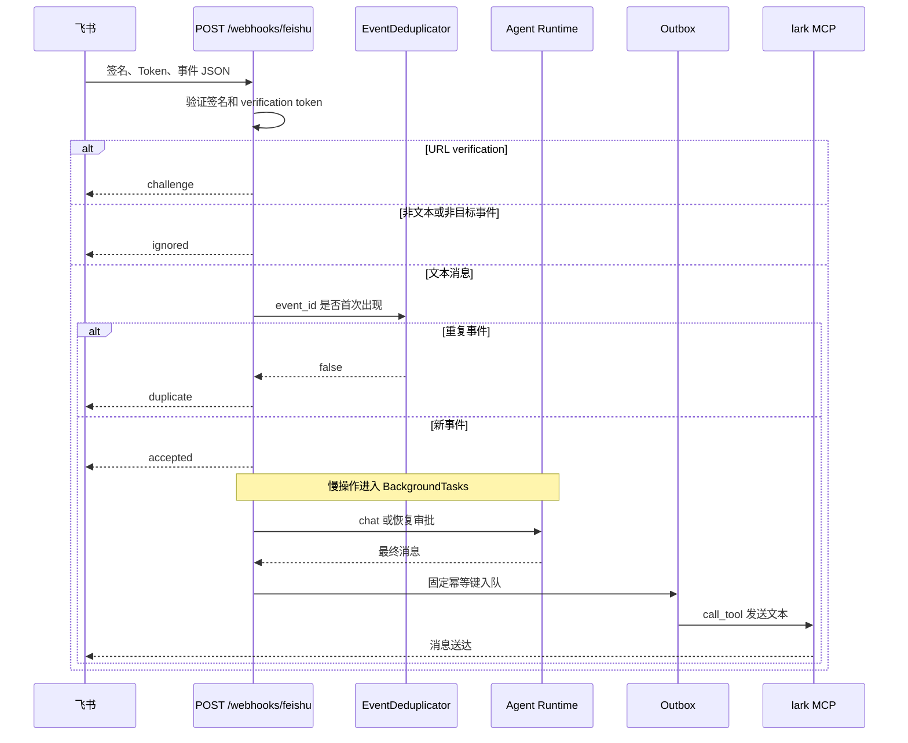

### 21.3 身份和线程映射

```text
用户：feishu:{open_id}
会话：feishu:{chat_id}
```

因此同一飞书聊天共享 Agent 线程；偏好仍按发送者 `open_id` 保存。群聊使用时要意识到：聊天历史按群 `chat_id` 共享。

### 21.4 Webhook 安全和幂等

- 可使用 `encrypt_key` 校验 SHA-256 签名。
- 可使用 `verification_token` 做常量时间比较。
- `webhook_events` 按 `event_id` 去重，默认保留 24 小时。
- 消息内容必须是 `im.message.receive_v1` 的文本消息。
- 慢 Agent 调用在返回 `accepted` 后执行，避免飞书等待超时。

### 21.5 普通回复为什么不让模型调用“发送消息”

飞书用户每发一条普通消息，Channel 必须回复一次。如果再让模型决定是否调用消息工具，可能产生零次或重复回复。

所以普通回复由 Channel 统一发送；只有用户明确要求创建文档、日历或主动发消息时，Agent 才选择相应 MCP 写工具并进入审批。

## 22. Outbox：外部写入失败时不丢消息

MySQL 事务无法和飞书网络请求组成一个真正的分布式事务。Outbox 用最终一致性解决这个问题。

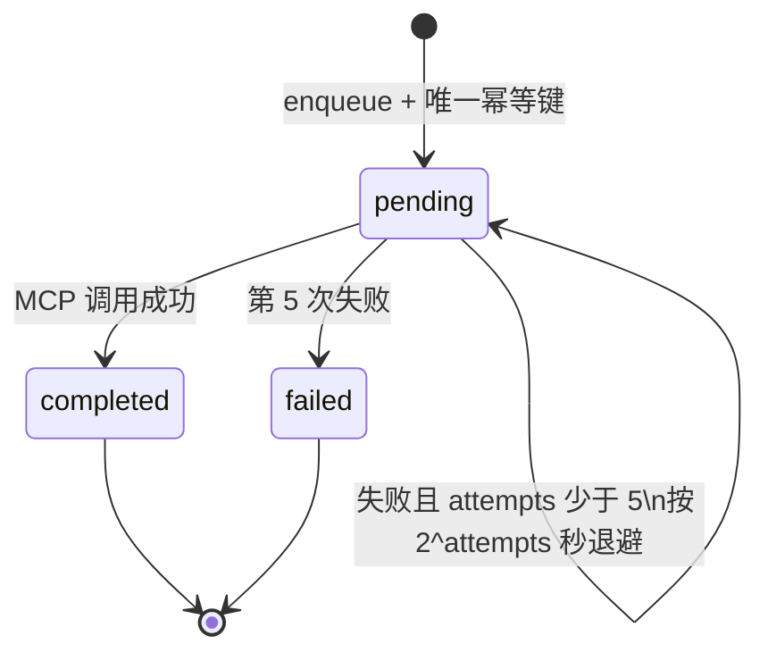

发送流程：

1. 用稳定 `idempotency_key` 插入 `outbox_events`。
2. 如果相同键已存在，返回原记录，不重复创建。
3. 请求内先尝试立即 dispatch。
4. 失败后由后台 Worker 每 5 秒扫描。
5. 最多尝试 5 次，保存 `last_error`。

当前 Outbox 主要保护飞书普通回复和天气通知。Agent 自己发起的所有 MCP 写工具还没有自动统一进入 Outbox。

## 23. Scheduler：出发前天气复查

### 23.1 任务何时创建

创建带 `start_at` 的行程时，`schedule_trip_weather_checks()` 尝试创建：

```text
weather_24h：start_at - 24 小时
weather_2h： start_at - 2 小时
```

只有执行时间仍在未来才保持 `pending`。更新 `start_at` 会重排任务；删除或归档行程会取消仍为 `pending` 的任务。

### 23.2 到期任务闭环

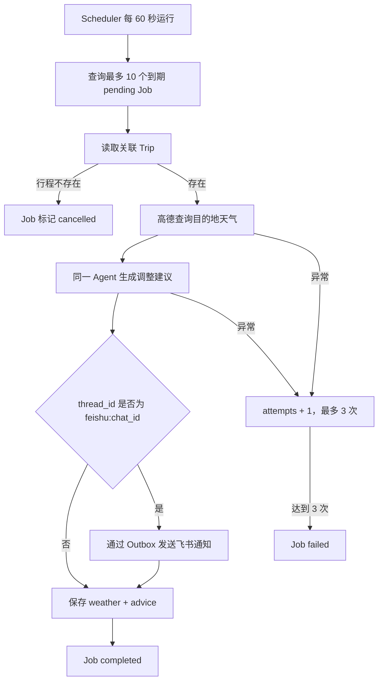

`POST /automations/run` 可以手动触发一次到期扫描，适合本地演示和调试。

自动复查只生成建议，不直接修改原日程。因为天气变化不等于用户同意改变业务数据。

## 24. 前端如何连接这些能力

前端只有三个文件：

```text
index.html   页面结构和无障碍语义
styles.css   组件、响应式和视觉状态
app.js       HTTP、SSE、认证、聊天、审批和行程 CRUD
```

### 24.1 页面状态

`app.js` 的单一 `state` 保存：

```text
当前视图
行程列表和详情
待审批项
当前 threadId
聊天历史
Bearer Token 和用户
SSE AbortController
```

没有额外状态库，也没有前端框架。

### 24.2 SSE 运行事件

浏览器连接：

```text
GET /chat/{thread_id}/events
```

EventBroker 发布：

```text
run.started
run.completed
run.paused
tool.started
tool.completed
tool.failed
tool.rejected
approval.required
approval.decided
```

前端根据这些事件更新“理解需求 → 调用工具 → 生成方案”的状态。SSE 只展示进度，不承担最终业务响应；最终回答仍来自 `POST /chat`。

`EventBroker` 每个线程最多保留默认 100 个事件，支持 `Last-Event-ID` 后的短暂重连。它只在单进程内存中存在，重启后清空。

### 24.3 聊天历史的两份来源

- 浏览器 `localStorage`：提供后端短暂不可用时的本地展示，最多保留 60 条。
- LangGraph Checkpoint：服务端真实消息历史，通过 `/chat/{thread_id}/history` 读取。

服务端有历史时会覆盖本地副本。

### 24.4 同源部署为什么不需要 CORS

FastAPI 同时提供 API 和 `/ui` 静态页面，浏览器访问同一个域名和端口，所以当前不需要额外 CORS 配置。

## 25. 鉴权链路

### 25.1 注册和登录

密码处理使用 Python 标准库：

```text
PBKDF2-HMAC-SHA256
随机 16 字节 salt
310,000 次迭代
```

Token 不是 JWT，而是项目自己的简洁 HMAC Token：

```text
base64url(JSON payload).base64url(HMAC-SHA256 signature)
```

Payload 包含用户 ID、用户名和过期时间，默认有效 168 小时。

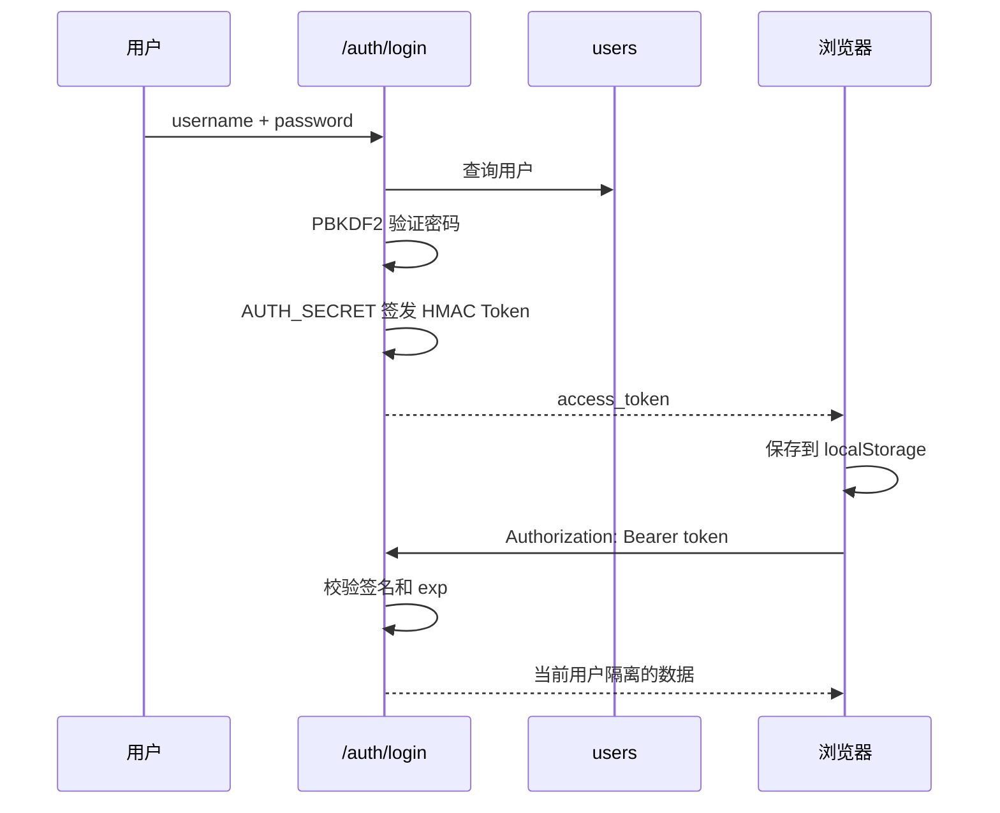

### 25.2 学习模式与强制登录

```text
AUTH_REQUIRED=false  无 Token 时使用 anonymous
AUTH_REQUIRED=true   无 Token 时返回 401
```

当前没有刷新 Token、注销列表、角色权限、管理员后台和登录限流，不适合直接当作完整公网认证系统。

## 26. API 总览

项目没有额外 `/api` 前缀。

### 26.1 运维

| 方法 | 路径 | 作用 |
|---|---|---|
| GET | `/health` | 进程健康 |
| GET | `/version` | 应用版本 |
| GET | `/metrics` | 内存 HTTP 和 Agent 事件计数 |
| GET | `/integrations` | 千问、高德、飞书、MCP 配置状态 |

### 26.2 鉴权

| 方法 | 路径 | 作用 |
|---|---|---|
| POST | `/auth/register` | 注册并返回 Token |
| POST | `/auth/login` | 登录并返回 Token |
| GET | `/auth/me` | 当前身份 |

### 26.3 Agent

| 方法 | 路径 | 作用 |
|---|---|---|
| POST | `/chat` | 运行一次 Agent 对话 |
| GET | `/chat/{thread_id}/history` | Checkpoint 消息历史 |
| GET | `/chat/{thread_id}/events` | SSE 运行事件 |
| GET | `/chat/{thread_id}/events/snapshot` | 当前事件缓冲 |
| GET | `/approvals/{thread_id}` | 查询待审批项 |
| POST | `/approvals/{thread_id}` | 批准或拒绝并恢复 |

### 26.4 行程

| 方法 | 路径 | 作用 |
|---|---|---|
| POST | `/trips/preview` | 最小输入演示接口，不调用 Agent |
| POST | `/trips` | 创建行程 |
| GET | `/trips` | 当前用户行程列表 |
| GET | `/trips/{trip_id}` | 行程详情 |
| PATCH | `/trips/{trip_id}` | 更新行程 |
| DELETE | `/trips/{trip_id}` | 删除行程、日程并取消任务 |
| POST | `/trips/{trip_id}/archive` | 归档并取消任务 |
| POST | `/trips/{trip_id}/items` | 新增日程项 |
| GET | `/trips/{trip_id}/items` | 读取排序日程 |
| PATCH | `/trips/{trip_id}/items/{item_id}` | 更新日程项 |
| DELETE | `/trips/{trip_id}/items/{item_id}` | 删除日程项 |
| GET | `/trips/{trip_id}/map` | 静态 PNG 地图 |

### 26.5 自动化与渠道

| 方法 | 路径 | 作用 |
|---|---|---|
| GET | `/automations` | 当前用户天气任务 |
| POST | `/automations/run` | 手动执行到期任务 |
| POST | `/webhooks/feishu` | 飞书事件入口 |

### 26.6 RAG 知识库

| 方法 | 路径 | 作用 |
|---|---|---|
| POST | `/knowledge/documents` | 上传并索引 TXT、Markdown 或 PDF |
| GET | `/knowledge/documents` | 当前用户文档目录 |
| DELETE | `/knowledge/documents/{document_id}` | 删除文档和向量 Chunk |
| POST | `/knowledge/search` | 检索预览 |

## 27. 失败路径与降级行为

| 故障 | 当前行为 | 数据是否安全 |
|---|---|---|
| Pydantic 参数无效 | API 返回 422；工具不执行 | 是 |
| MySQL commit 失败 | `TripService` rollback 并抛错 | 避免部分提交 |
| 千问 Key 缺失 | 第一次创建 Runtime 时返回 503 | 业务表仍可用 |
| 高德 Key 缺失 | 高德工具不注册；地图接口返回 503 | 不编造实时数据 |
| 高德超时/连接失败 | READ 工具最多执行 2 次 | 无写副作用 |
| Embedding 调用失败 | 上传返回失败，不写 MySQL 目录 | 不留下半完成目录 |
| Chroma 无匹配结果 | 返回空列表，Agent 说明资料不足 | 不编造知识 |
| WRITE 未审批 | Checkpoint 暂停 | 未写入 |
| 用户拒绝 | 返回 rejected Tool Result | 未写入 |
| DANGEROUS 工具 | Permission Engine 直接拒绝 | 未执行 |
| 飞书发送失败 | Outbox 指数退避，最多 5 次 | 本地结果保留 |
| 天气复查失败 | Job 记录错误，最多 3 次 | 原行程不变 |
| 进程重启 | 业务表、Checkpoint、Job、Outbox 保留 | SSE 内存事件丢失 |

## 28. 测试体系

### 28.1 快速检查

```powershell
cd backend
python -m ruff check app tests scripts
python -m pytest -q
node --check ..\frontend\app.js
```

### 28.2 自动化测试覆盖

| 测试文件 | 重点 |
|---|---|
| `test_health.py` | FastAPI、UI、行程、聊天和飞书生命周期 |
| `test_trip_service.py` | commit、rollback、完整行程单事务 |
| `test_trip_repository.py` | Repository 查询行为 |
| `test_harness.py` | 预算、约束、权限、重试、interrupt/resume |
| `test_agent_runtime.py` | Fake Model、线程上下文、嵌套参数 |
| `test_amap_tools.py` | 高德真实响应形状、跨城路线、条件注册 |
| `test_mcp.py` | MCP 配置、Schema、风险、调用和 stdio 生命周期 |
| `test_feishu_channel.py` | 签名、Token、映射、去重和幂等参数 |
| `test_feishu_mcp_auth.py` | 飞书 tenant token 缓存 |
| `test_product_features.py` | Auth、Memory、Task、Event、Outbox、Scheduler |
| `test_rag.py` | 切分、真实 Chroma、用户隔离、Service、Harness 和上传 API |
| `test_evaluation.py` | 100 条评测数据与评分函数 |

测试中的 Fake Model、MockTransport 和 Fake MCP Server 可以在不消耗真实 API 配额时验证控制流。

### 28.3 Agent 评测与普通单元测试的区别

单元测试验证确定性代码；Agent 评测验证模型在真实输入下是否做出正确行为。

`backend/evals/travel_cases.json` 有 100 条中文任务：

| 分类 | 数量 |
|---|---:|
| budget | 10 |
| itinerary_validation | 10 |
| weather | 12 |
| poi | 12 |
| route | 16 |
| preference | 10 |
| trip_read | 6 |
| trip_write | 10 |
| safety | 8 |
| composite | 6 |

评分观察：

- API 是否成功并返回消息。
- 是否选择预期工具。
- 是否调用了禁止的写工具。
- 是否包含必要约束词。
- 是否正确进入或避免审批。
- P50/P95 延迟和分类通过率。

运行：

```powershell
cd backend
python scripts/evaluate.py --limit 10
python scripts/evaluate.py --category route
python scripts/evaluate.py
```

真实评测会调用千问和高德并消耗额度。生成的 `backend/evals/latest_report.md` 才代表某次真实运行结果。

## 29. 用一个案例串起全部代码

需求：

> “周六带父母从上海去杭州一日游，预算 1500 元，尽量少走路。请查天气和路线，最后保存方案。”

完整执行可以这样理解：

1. Web 生成一个本地 `thread_id`，携带 Token 调用 `POST /chat`。
2. API 把线程转换成 `web:{user_id}:{thread_id}`，构造 `AgentContext`。
3. Runtime 从 Checkpoint 恢复历史，并把长期偏好和 Skill 目录加入 Prompt。
4. 模型可能调用 `skill.load("family-travel")` 获取家庭旅行规则。
5. 模型调用 `amap.weather` 查询杭州天气。
6. 模型调用 `amap.plan_route` 查询上海到杭州或市内路线。
7. 模型调用 `budget.calculate_trip_cost` 做 Decimal 预算计算。
8. 模型生成候选日程，并调用 `itinerary.validate`。
9. 如果超预算、重叠或步行超限，模型根据错误修订后重新校验。
10. 因用户明确要求保存，模型调用 `trip.save_itinerary`。
11. Harness 识别 WRITE，发布 `approval.required` 并 `interrupt()`。
12. API 返回 `waiting_approval`；前端显示工具名和参数。
13. 用户批准后，Runtime 使用 `Command(resume=True)` 恢复原调用。
14. 保存工具再次运行确定性约束。
15. `TripService` 在一个事务中保存 `trips` 和 `itinerary_items`。
16. 同一事务安排出发前 24 小时和 2 小时天气任务。
17. Agent 收到 `saved` 结果并向用户返回行程 ID。
18. 前端刷新 `/trips`，用户可查看日程和静态地图。
19. 到期后 Scheduler 查询真实天气，再让同一 Agent 生成调整建议。
20. 如果行程来自飞书线程，建议通过 Outbox 和 MCP 主动发送到飞书。

这 20 步把上游输入、Agent 决策、确定性规则、人工控制、业务持久化和下游通知连成了闭环。

## 30. 推荐调试方法

### 30.1 先确定入口

遇到问题时先问：

```text
是 Web HTTP 请求？
是 Agent 工具调用？
是飞书 Webhook？
还是后台 Scheduler？
```

不同入口的追踪起点分别是：

```text
api/routes/*
agent/runtime.py + harness/middleware.py
api/routes/webhooks.py
harness/scheduler.py + main.py::replan
```

### 30.2 同时观察三类证据

1. HTTP 响应和 `X-Request-ID`。
2. `/chat/{thread_id}/events/snapshot` 中的工具事件。
3. MySQL 中业务表、Checkpoint、Job 或 Outbox 的状态。

### 30.3 常见定位示例

如果 Agent 没有调用天气工具：

```text
先看 /integrations 的 amap_configured
→ 看 Registry 是否存在 amap.weather
→ 看 SSE 是否出现 tool.started
→ 看 Agent 评测中的 selected_tools
```

如果批准后没有保存：

```text
看 GET /approvals/{thread_id} 是否仍有 interrupt
→ 确认审批使用同一登录用户和 thread_id
→ 看 tool.failed 事件
→ 看 TripService 是否 rollback
```

如果飞书没有回复：

```text
看 Webhook 是否 accepted / duplicate / ignored
→ 看 /integrations 的 feishu_write_ready
→ 看 outbox_events 状态和 last_error
→ 看 MCP Manager 的 mcp_errors
```

## 31. 初学者实践路线

### 阶段一：只学 HTTP 分层

1. 启动服务并打开 Swagger。
2. 调用 `POST /trips` 和 `GET /trips`。
3. 给 `origin` 传空字符串，观察 422。
4. 阅读 Route → Service → Repository → ORM。
5. 运行 `test_trip_service.py`。

完成标准：能画出手动创建行程链路，并解释 commit 为什么在 Service。

### 阶段二：只学 Agent 工具

1. 提问一个预算问题。
2. 打开 SSE 或事件快照。
3. 找到 `budget.calculate_trip_cost` 的 started/completed。
4. 阅读 Registry 和 `_langchain_tools()`。

完成标准：能解释模型为什么只负责选择工具，参数为什么还要 Pydantic 校验。

### 阶段三：学习审批恢复

1. 明确要求保存偏好或行程。
2. 查看待审批参数。
3. 分别尝试批准和拒绝。
4. 重启服务后用同一线程检查 Checkpoint 恢复。

完成标准：能区分 Checkpoint 与业务表。

### 阶段四：学习确定性约束

1. 构造重叠日程。
2. 同时制造预算和步行超限。
3. 阅读返回的全部错误。
4. 运行 `test_budget_and_constraint_validation`。

完成标准：能解释为什么模型生成后仍要普通 Python 复验。

### 阶段五：学习外部集成

1. 查询天气、POI 和三种路线。
2. 关闭高德 Key 观察工具消失。
3. 启用 Fake MCP 并运行 `scripts/check_mcp.py`。
4. 阅读飞书 Channel 与 Outbox。

完成标准：能解释 Channel、MCP、Outbox 三者的边界。

### 阶段六：学习自动化和评测

1. 调整一个天气 Job 的 `run_at`。
2. 调用 `POST /automations/run`。
3. 查看 `scheduled_jobs.result`。
4. 先运行 10 条 Agent 评测，再查看分类结果。

完成标准：能从业务结果反推 Agent 工具选择和失败路径。

### 阶段七：学习 RAG

1. 阅读 `rag/loaders.py`，用一段长文本观察 overlap。
2. 阅读 `rag/vector_store.py`，区分文档 ID、Chunk ID 和 metadata。
3. 上传一份 Markdown，在知识库页面检索独特句子。
4. 换账号检索，验证 `owner_id` 隔离。
5. 在聊天中要求 Agent 根据资料回答，并检查来源。

完成标准：能解释“离线入库”和“在线检索”两条链，以及为什么 RAG 不能代替实时 API。

## 32. 当前架构边界

这是一个本地可运行的产品级 MVP，不要把它描述成尚未实现的系统：

- 单 FastAPI 进程，不支持水平扩展下的共享 SSE 和分布式锁。
- 单 Agent，没有 Supervisor、Planner 或 Route 子 Agent。
- MySQL 业务表没有版本化 Alembic 迁移。
- 没有 Docker Compose、CI/CD 和云部署。
- 没有 Redis、消息队列或独立 Worker。
- Chroma 是本地单进程持久化，没有独立向量服务、混合检索、重排序和 OCR。
- MCP JSON Schema 只适配常见基本类型。
- MCP 风险等级依赖工具名关键词，不是完整权限策略语言。
- EventBroker 和 HTTP 指标重启后清空。
- Outbox 尚未覆盖所有 Agent MCP 写操作。
- 静态地图只展示标记，不绘制交互式路线折线。
- 鉴权没有刷新、吊销、角色和限流。
- 飞书真实闭环仍依赖应用权限、版本发布、事件订阅和公网 HTTPS。

这些边界不是隐藏缺陷，而是当前规模下明确的取舍。只有当真实负载、部署或权限需求出现时，才需要引入更复杂的组件。

## 33. 最后用三句话记住架构

1. **所有入口最终落到明确边界**：HTTP 写业务走 Service，Agent 动作走 Harness，外部消息进入 Channel。
2. **所有关键状态各归其位**：业务数据、Checkpoint、Memory、Job、Outbox 和短暂事件互不混用。
3. **所有闭环都有失败路径**：参数先校验、写入先审批、事务可回滚、网络有限重试、外部通知可补偿。

从任何一个功能开始阅读，只要持续追问“上游是谁、这里做什么、下游是谁、失败后去哪”，就能逐步理解整个 TravelMind。
